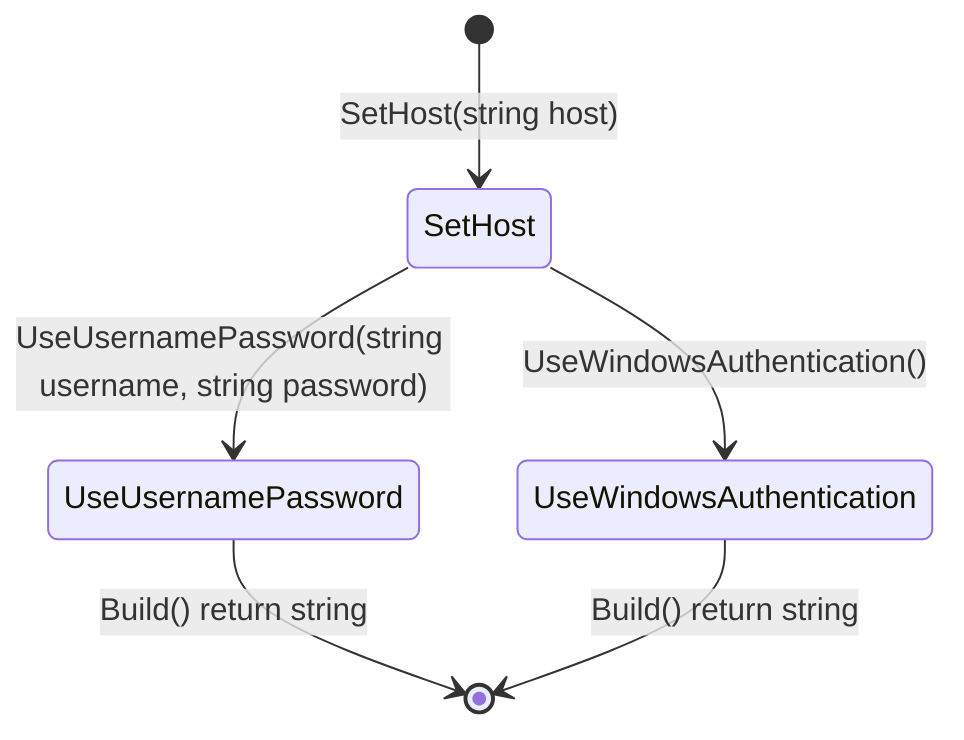

```cs
#StateType : ConnectionStringModel
#BuilderContextType : ConnectionStringModel
#Namespace : Newbe.ObjectVisitor.Tests.ConnectionStringBuilderFluentApi
#BuilderTypeName : ConnectionStringBuilder

```


