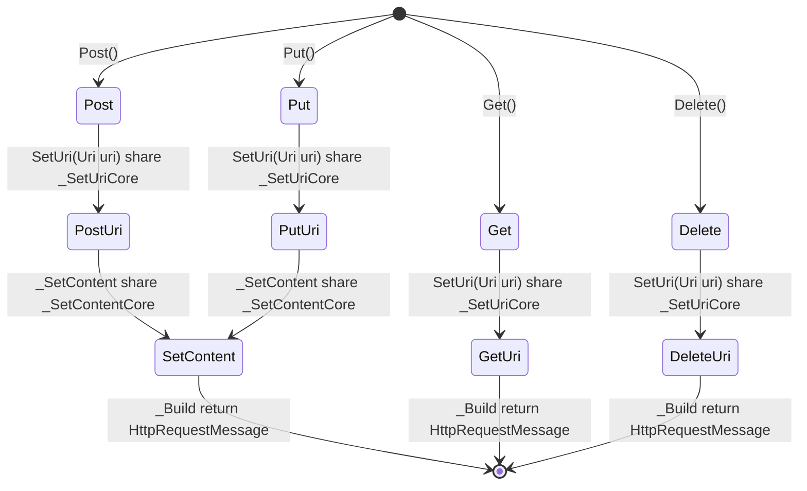

```cs
#StateType : HttpRequestMessage
#BuilderContextType : HttpRequestMessage
#Namespace : Newbe.ObjectVisitor.Tests.HttpClientFluentApi
#BuilderTypeName : RequestBuilder

_SetUriCore : SetUri(Uri uri)
_SetContentCore : SetUri(Uri uri)
_SetHeadersCore : SetHeaders(HttpRequestHeaders headers)

_SetHeaders : SetHeaders(HttpRequestHeaders headers)
_SetContent : SetContent(HttpContent content)
_Build : Build()

```


