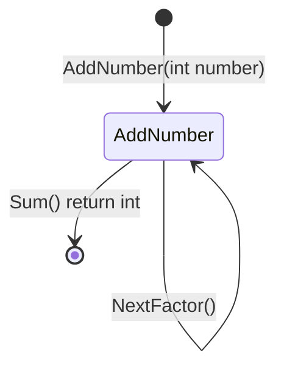

```cs
#StateType : List<List<int>>
#BuilderContextType : List<List<int>>
#Namespace : Newbe.ObjectVisitor.Tests.SumBuilderFluentApi
#BuilderTypeName : MultipleSumBuilder

```


```mermaid
stateDiagram
    [*]  --> AddNumber : AddNumber(int number)
    AddNumber  --> AddNumber : AddNumber(int number)
    AddNumber  --> AddNumber : NextFactor()
    AddNumber --> [*] : Sum() return int
```
