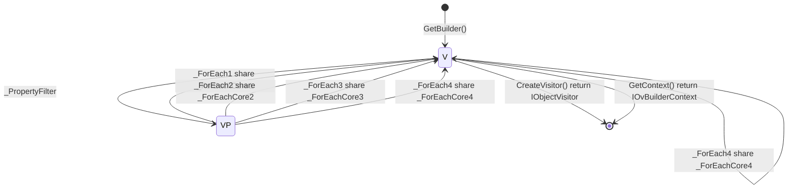

```cs
#BuilderContextType : IOvBuilderContext<T>
#Namespace : Newbe.ObjectVisitor
#BuilderTypeName : ObjectVisitorBuilder<T>

_PropertyFilter : FilterProperty(Func<PropertyInfo, bool>? propertyInfoFilter)

_ForEach1 : ForEach(Expression<Action<IObjectVisitorContext<T, object>>> foreachAction)
_ForEach2 : ForEach(Expression<Action<string, object>> foreachAction)
_ForEach3 : ForEach<TValue>(Expression<Action<IObjectVisitorContext<T, TValue>>> foreachAction)
_ForEach4 : ForEach<TValue>(Expression<Action<string, TValue>> foreachAction)

_ForEachCore1 : ForEach(Expression<Action<IObjectVisitorContext<T, object>>> foreachAction)
_ForEachCore2 : ForEach(Expression<Action<string, object>> foreachAction)
_ForEachCore3 : ForEach<TValue>(Expression<Action<IObjectVisitorContext<T, TValue>>> foreachAction)
_ForEachCore4 : ForEach<TValue>(Expression<Action<string, TValue>> foreachAction)

```


