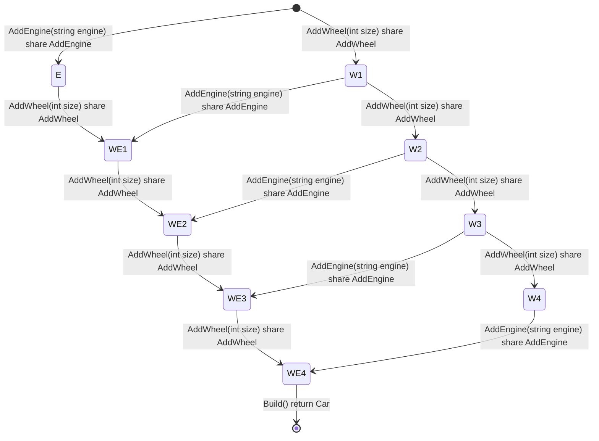

```cs
#StateType : Car
#BuilderContextType : Car
#Namespace : Newbe.ObjectVisitor.Tests.CarBuilder
#BuilderTypeName : CarBuilder

AddWheel : AddWheel(int size)
AddEngine : AddEngine(string engine)

```


