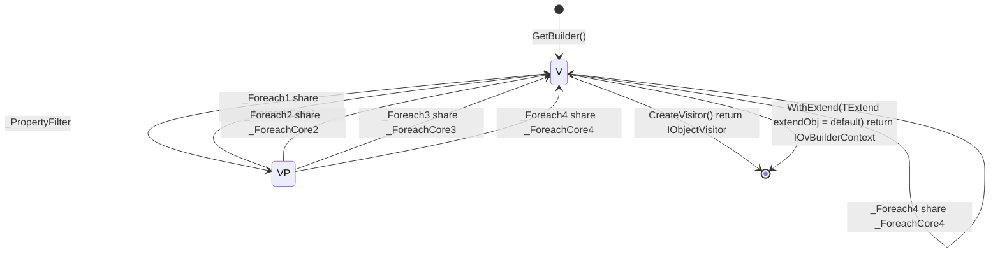

```cs
#StateType : IOvBuilderContext<T>
#BuilderContextType : IOvBuilderContext<T>
#Namespace : Newbe.ObjectVisitor
#BuilderTypeName : ObjectVisitorBuilder<T>

_PropertyFilter : FilterProperty(Func<PropertyInfo, bool>? propertyInfoFilter)

_Foreach1 : Foreach(Expression<Action<IObjectVisitorContext<T, object>>> foreachAction)
_Foreach2 : Foreach(Expression<Action<string, object>> foreachAction)
_Foreach3 : Foreach<TValue>(Expression<Action<IObjectVisitorContext<T, TValue>>> foreachAction)
_Foreach4 : Foreach<TValue>(Expression<Action<string, TValue>> foreachAction)

_ForeachCore1 : Foreach(Expression<Action<IObjectVisitorContext<T, object>>> foreachAction)
_ForeachCore2 : Foreach(Expression<Action<string, object>> foreachAction)
_ForeachCore3 : Foreach<TValue>(Expression<Action<IObjectVisitorContext<T, TValue>>> foreachAction)
_ForeachCore4 : Foreach<TValue>(Expression<Action<string, TValue>> foreachAction)

```


