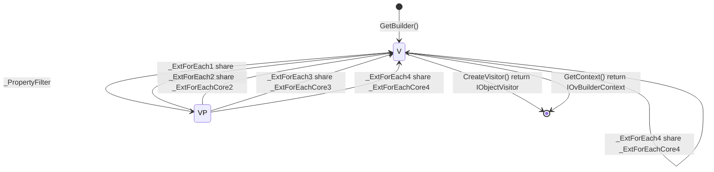

```cs
#BuilderContextType : IOvBuilderContext<T, TExtend>
#Namespace : Newbe.ObjectVisitor
#BuilderTypeName : OVBuilderExt<T, TExtend>

_PropertyFilter : FilterProperty(Func<PropertyInfo, bool>? propertyInfoFilter)

_ExtForEach1 : ForEach(Expression<Action<IObjectVisitorContext<T, TExtend, object>>> foreachAction)
_ExtForEach2 : ForEach(Expression<Action<string, object, TExtend>> foreachAction)
_ExtForEach3 : ForEach<TValue>(Expression<Action<IObjectVisitorContext<T, TExtend, TValue>>> foreachAction)
_ExtForEach4 : ForEach<TValue>(Expression<Action<string, TValue, TExtend>> foreachAction)

_ExtForEachCore1 : ForEachObject(Expression<Action<IObjectVisitorContext<T, TExtend, object>>> foreachAction)
_ExtForEachCore2 : ForEachObject(Expression<Action<string, object, TExtend>> foreachAction)
_ExtForEachCore3 : ForEach<TValue>(Expression<Action<IObjectVisitorContext<T, TExtend, TValue>>> foreachAction)
_ExtForEachCore4 : ForEach<TValue>(Expression<Action<string, TValue, TExtend>> foreachAction)

```


