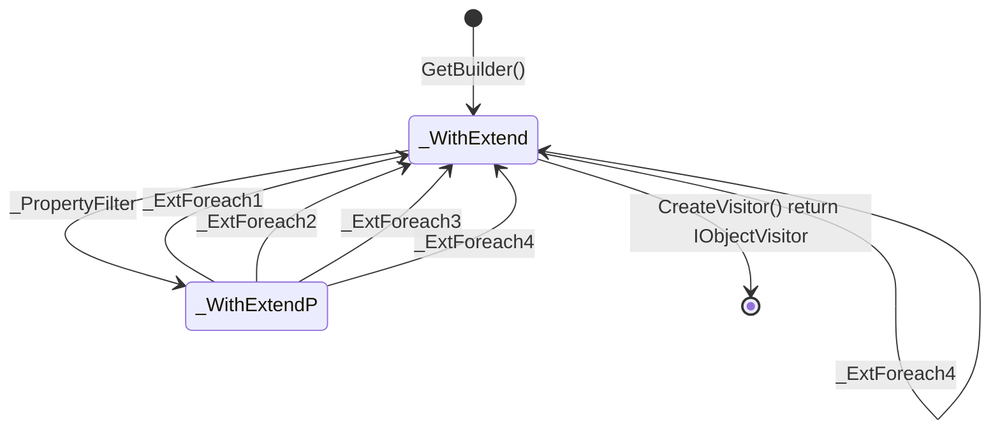

```cs
#StateType : IOvBuilderContext<T, TExtend>
#StartObjectType : IOvBuilderContext<T, TExtend>
#Namespace : Newbe.ObjectVisitor
#StateChangerType : ObjectVistorWithExtendBuilderStateChanger

_PropertyFilter : FilterProperty(Func<PropertyInfo, bool>? propertyInfoFilter)

_ExtForeach1 : ForeachExpression<Action<IObjectVisitorContext<T, TExtend, object>>> foreachAction)
_ExtForeach2 : ForeachExpression<Action<string, object, TExtend>> foreachAction)
_ExtForeach3 : Foreach<TValue>(Expression<Action<IObjectVisitorContext<T, TExtend, TValue>>> foreachAction)
_ExtForeach4 : Foreach<TValue>(Expression<Action<string, TValue, TExtend>> foreachAction)

_WithExtend : WithExtend_T,TExtend_
_WithExtendP : WithExtendP_T,TExtend_
```


