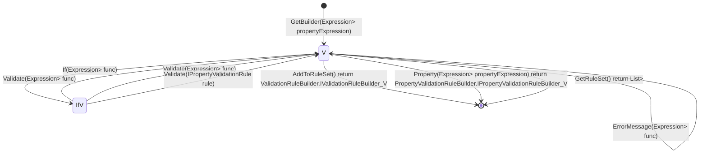

```cs
#BuilderContextType : ValidationRuleBuilder<T>.IValidationRuleBuilder_V
#Namespace : Newbe.ObjectVisitor.Validator
#BuilderTypeName : PropertyValidationRuleBuilder<T,TValue>

```


```mermaid
stateDiagram
    [*] --> V : GetBuilder(Expression<Func<T,TValue>> propertyExpression)
    V --> V : Validate(Expression<Func<T,TValue,PropertyInfo,bool>> func)
    V --> V : Validate(Expression<Func<TValue,bool>> func)
    V --> V : Validate(IPropertyValidationRule<T, TValue> rule)
    V --> V : ErrorMessage(Expression<Func<T,TValue,PropertyInfo,string>> func)
    V --> IfV : If(Expression<Func<T,TValue,PropertyInfo,bool>> func)
    IfV --> V : Validate(Expression<Func<T,TValue,PropertyInfo,bool>> func)
    IfV --> V : Validate(Expression<Func<TValue,bool>> func)
    IfV --> V : Validate(IPropertyValidationRule<T, TValue> rule)


    V --> [*] : AddToRuleSet() return ValidationRuleBuilder<T>.IValidationRuleBuilder_V
    V --> [*] : Property<TNewValue>(Expression<Func<T, TNewValue>> propertyExpression) return PropertyValidationRuleBuilder<T,TNewValue>.IPropertyValidationRuleBuilder_V
    V --> [*] : GetRuleSet() return List<ValidationRule<T>>

```
