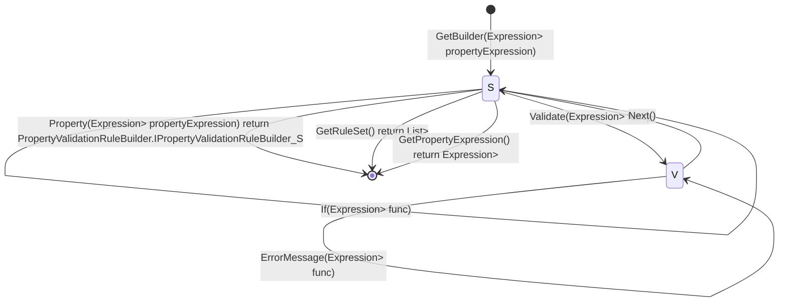

```cs
#BuilderContextType : ValidationRuleGroupBuilder<T>.IValidationRuleGroupBuilder_S
#Namespace : Newbe.ObjectVisitor.Validator
#BuilderTypeName : PropertyValidationRuleBuilder<T,TValue>

```


```mermaid
stateDiagram
    [*] --> S : GetBuilder(Expression<Func<T,TValue>> propertyExpression)
    S --> V : Validate(Expression<Func<T,TValue,PropertyInfo,bool>> func)
    V --> V : ErrorMessage(Expression<Func<T,TValue,PropertyInfo,string>> func)
    S --> S : If(Expression<Func<T,TValue,PropertyInfo,bool>> func)
    V --> S : Next()

    S --> [*] : Property<TNewValue>(Expression<Func<T, TNewValue>> propertyExpression) return PropertyValidationRuleBuilder<T,TNewValue>.IPropertyValidationRuleBuilder_S
    S --> [*] : GetRuleSet() return List<ValidationRuleGroup<T>>
    S --> [*] : GetPropertyExpression() return Expression<Func<T,TValue>>

```
