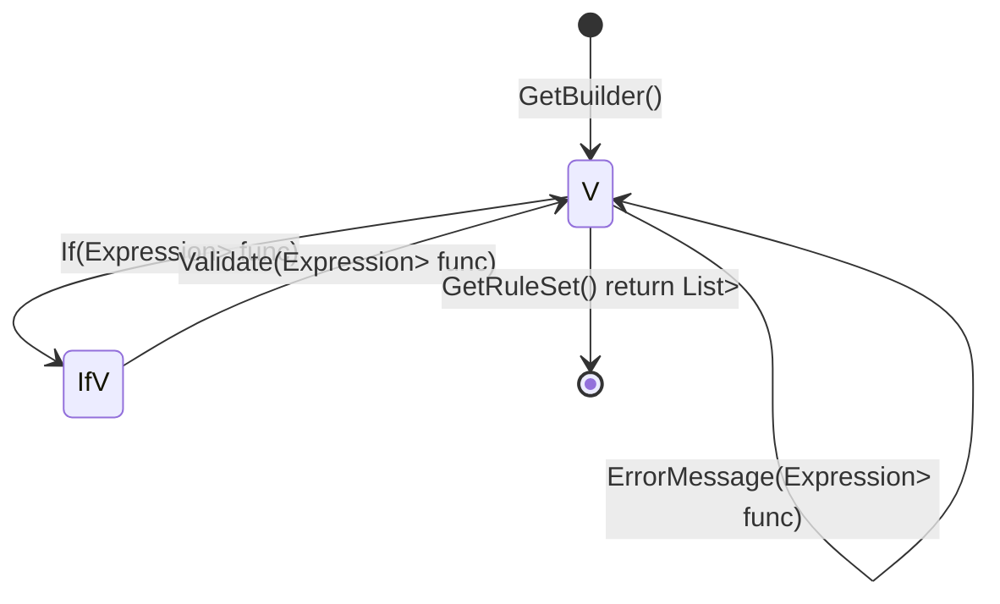

```cs
#BuilderContextType : List<ValidationRule<T>>
#Namespace : Newbe.ObjectVisitor.Validator
#BuilderTypeName : ValidationRuleBuilder<T>

```


```mermaid
stateDiagram
    [*] --> V : GetBuilder()
    V --> V : Validate(Expression<Func<T,bool>> func)
    V --> V : ErrorMessage(Expression<Func<T,string>> func)
    V --> IfV : If(Expression<Func<T,bool>> func)
    IfV --> V : Validate(Expression<Func<T,bool>> func)

    V --> [*] : GetRuleSet() return List<ValidationRule<T>>
```
