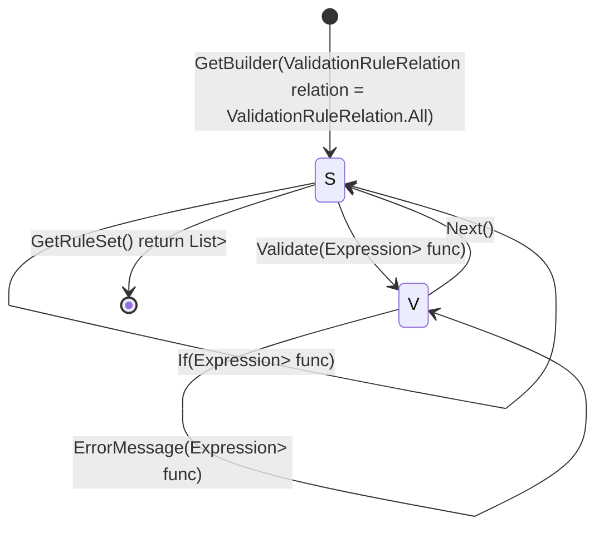

```cs
#BuilderContextType : List<ValidationRuleGroup<T>>
#Namespace : Newbe.ObjectVisitor.Validator
#BuilderTypeName : ValidationRuleGroupBuilder<T>

```


```mermaid
stateDiagram
    [*] --> S : GetBuilder(ValidationRuleRelation relation = ValidationRuleRelation.All)
    S --> V : Validate(Expression<Func<T,bool>> func)
    V --> V : ErrorMessage(Expression<Func<T,string>> func)
    S --> S : If(Expression<Func<T,bool>> func)
    V --> S : Next()

    S --> [*] : GetRuleSet() return List<ValidationRuleGroup<T>>
```
